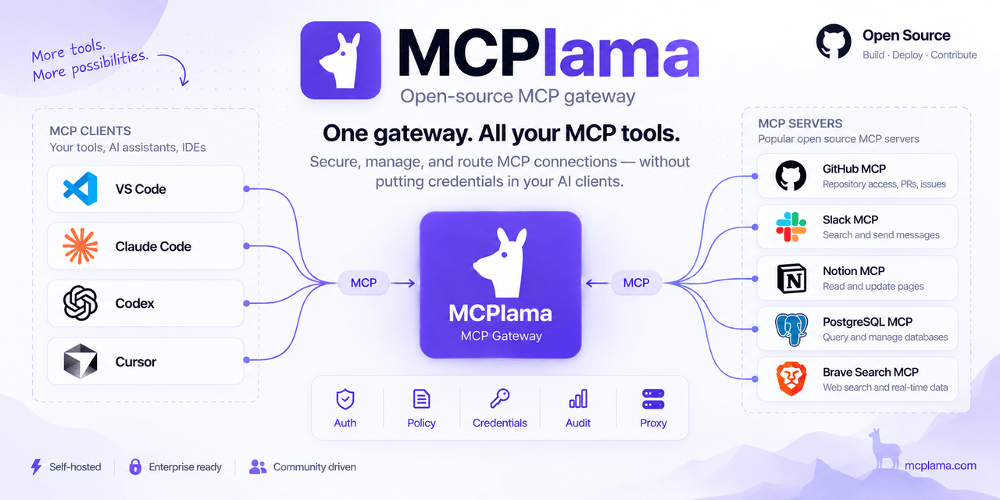
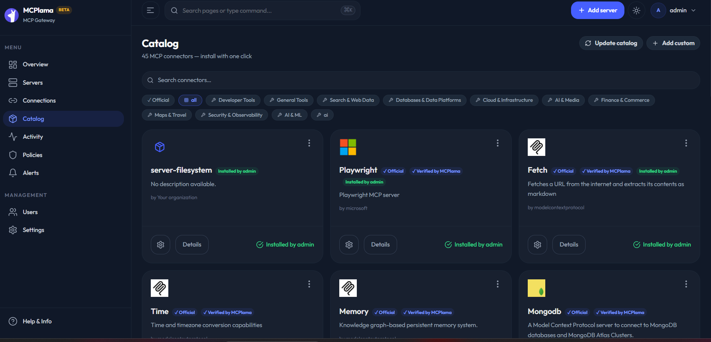
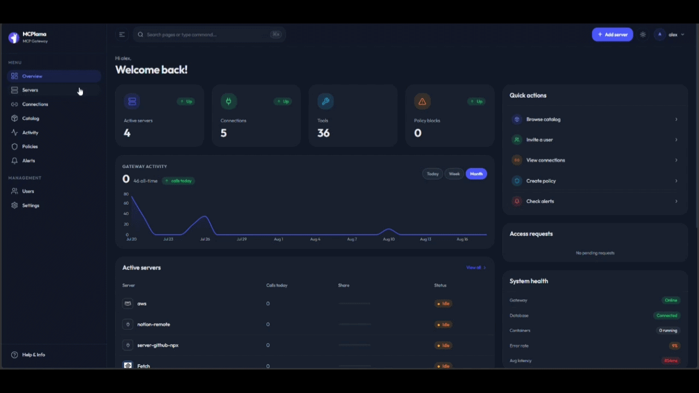
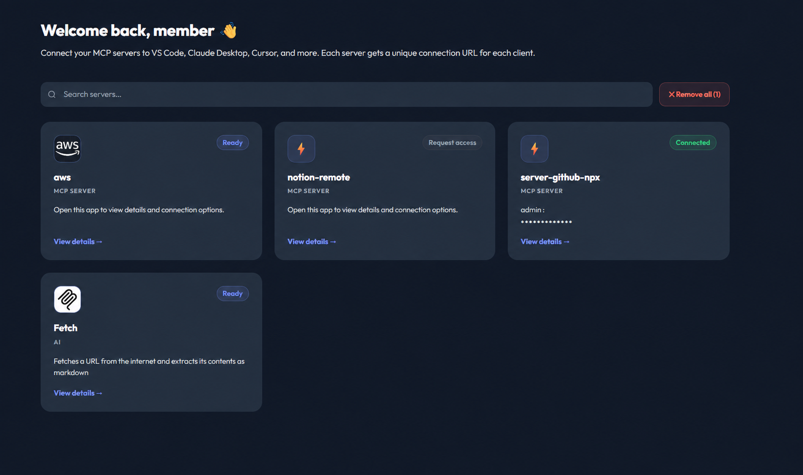

<h1 align="center">
  
  MCPlama
</h1>

<p align="center">
  <strong>Run and manage your team's MCP servers from one place</strong>
</p>

<p align="center">
  Open-source · Self-hosted · MCP Gateway &amp; Control Plane
</p>

<p align="center">
  <a href="https://github.com/mcplama/mcplama/stargazers"></a>
  <a href="https://github.com/mcplama/mcplama/blob/main/LICENSE"></a>
  <a href="https://hub.docker.com/r/mcplama/mcplama"></a>
</p>

MCPlama is a self-hosted MCP gateway and control plane for developers and teams who want to run multiple MCP servers without scattered credentials, duplicated client configuration, or unclear access.

Use it to centralize MCP server lifecycle, credentials, access policies, connections, and audit events while your AI clients connect through controlled MCP endpoints.



Instead of giving every AI client direct access to MCP servers and their credentials, configure your servers once in MCPlama and give each user a controlled connection URL.

## Why MCPlama?

MCP is easy to start with, but running multiple MCP servers across a team gets messy fast.

Without a control plane:

- 🔐 Credentials end up scattered across developer machines
- 🔌 Every client needs its own MCP configuration
- 👥 Access becomes difficult to grant and revoke
- 📋 Teams have little visibility into MCP activity
- 🐳 MCP servers still need somewhere to run and be managed
- 🛡️ Runtime access needs to be isolated from the gateway

MCPlama gives you one control point:

- 🌐 Controlled MCP connection URLs for your AI clients
- 🔐 Centralized OAuth and API credentials
- 👥 User and server access policies
- 📋 Audit logs for MCP activity
- 📦 MCP server catalog and lifecycle management
- 🛡️ Separate broker boundary for MCP container execution

Start locally with Docker. Move to shared team infrastructure when you need it.



## Documentation

See the [`docs`](docs/) directory for architecture, security, deployment, API, and development documentation.

- [Architecture](docs/ARCHITECTURE.md)
- [Security model](docs/SECURITY-MODEL.md)
- [Docker deployment](docs/DOCKER.md)
- [API reference](docs/API.md)
- [Contributing](CONTRIBUTING.md)

## Quickstart

This quickstart will show you how to:

1. Start MCPlama locally with Docker
2. Add and authorize an MCP server
3. Connect an MCP client through MCPlama

### Start MCPlama

Pull and run the published image:

```bash
docker pull mcplama/mcplama:latest

docker run -d --name mcplama \
  -p 8080:8080 \
  -v mcplama-data:/var/lib/postgresql \
  -v /var/run/docker.sock:/var/run/docker.sock \
  mcplama/mcplama:latest
```

Open:

```text
http://localhost:8080
```

Complete the setup wizard to create your admin account.

There is no default admin account.

### Add an MCP server

1. Open **Catalog**
2. Choose one of the pre-configured MCP servers
3. Click **Install**
4. Open the server's **Authorization** tab
5. Follow the setup steps and provide the required credentials
6. Click **Authorize**



### Connect through MCPlama

Open the server's **Connect** tab and create a connection token.

MCPlama gives you a URL like:

```text
http://localhost:8000/connect/mcp_your_token
```

Each user × server pair gets its own connection token. The underlying API credentials stay in MCPlama instead of being copied into the AI client's configuration.

You now have an MCP server running behind MCPlama with centralized credentials, access control, and auditing.

## Member portal

Team members can see and connect to the MCP servers available to them without receiving the underlying service credentials.



## How it works

When an AI client connects through MCPlama, the gateway:

1. Resolves the connection token to a user and server
2. Validates the request origin
3. Checks access policies
4. Injects OAuth/API credentials
5. Writes the audit log
6. Proxies the request to the MCP server

MCP server containers are started by a separate **broker** process.

The broker is the only component with Docker socket access in the recommended multi-container deployment. The gateway itself has no Docker access, and runner containers never receive the Docker socket.

See [Architecture](docs/ARCHITECTURE.md) and [Security model](docs/SECURITY-MODEL.md) for the full design.

## Connecting other MCP clients

Your connection URL can also be used with other MCP clients.

<details>
<summary><strong>Claude Desktop</strong></summary>

```json
{
  "mcpServers": {
    "notion": {
      "url": "http://localhost:8000/connect/mcp_your_token"
    }
  }
}
```

Restart Claude Desktop after updating the configuration.

</details>

<details>
<summary><strong>VS Code + GitHub Copilot</strong></summary>

Create `.vscode/mcp.json`:

```json
{
  "servers": {
    "notion": {
      "url": "http://localhost:8000/connect/mcp_your_token"
    }
  }
}
```

Requires VS Code 1.99+ with GitHub Copilot.

</details>

<details>
<summary><strong>Cursor</strong></summary>

Edit `~/.cursor/mcp.json`:

```json
{
  "mcpServers": {
    "notion": {
      "url": "http://localhost:8000/connect/mcp_your_token"
    }
  }
}
```

</details>

## Production

The quickstart is intended for evaluating MCPlama locally.

For production deployments, provide your own secrets and put an HTTPS reverse proxy in front of MCPlama.

See [Docker deployment](docs/DOCKER.md) and [Security model](docs/SECURITY-MODEL.md) before exposing MCPlama outside a trusted environment.

## Contributing

Contributions and feedback are welcome.

- [Contribution guidelines](CONTRIBUTING.md)
- [Development setup](docs/DEVELOPMENT.md)
- [Registry requests](docs/REGISTRY.md)

If you're already running MCP infrastructure for a team, feedback around credentials, access control, deployment, auditing, and MCP server lifecycle is especially useful.

## License

MCPlama is licensed under the GNU Affero General Public License, version 3 or any later version. See [LICENSE](LICENSE).

Third-party dependencies remain under their respective licenses. See [THIRD-PARTY-NOTICES](THIRD-PARTY-NOTICES).
